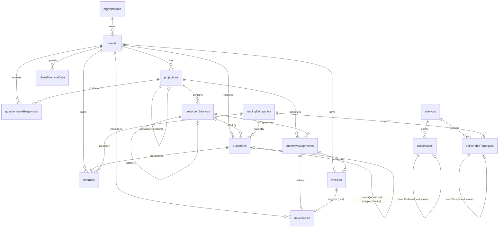

# Schema Coherence Audit + Convex Flow Canónico

**Fecha:** 2026-05-28
**Autor:** Christian + Claude (audit por 4 subagents paralelos)
**Estado:** spec — pendiente review user
**Misión:** Congelar el modelo de datos y el pipeline Convex antes de launch, eliminando código muerto, cerrando race conditions, y dejando documentación canónica que termine con el scope churn.

---

## 1. Resumen ejecutivo

Después de 561 commits y 20+ specs en los últimos 7 días, el schema tiene **26 tablas vivas** y el backend Convex tiene **30 directorios de functions**. El audit detectó:

- **0 leaks multi-tenant** (auth airtight)
- **3 bloqueantes pre-launch** (Firmame fuera de scope — ver §11)
- **5 queries del dashboard con full scan** (lentitud post-launch garantizada)
- **3 mutations con cascade roto** que pueden corromper datos vivos
- **8 mejoras importantes** (state machine guards, storage cleanup, índices nuevos, draft cleanup)
- **18 ítems de cleanup nice-to-have** post-launch (1 tabla zombie, 11 índices muertos, campos write-only)

Este spec entrega:

1. **Documentación canónica del schema actual** (ER + invariantes) — para que ya no haya scope churn.
2. **Pipeline Convex end-to-end documentado** con idempotencias, races identificados, caminos huérfanos.
3. **Plan de ejecución en 5 fases** priorizadas.
4. **Phase 1 detallado** (bloqueantes pre-launch + cascade fixes) listo para `writing-plans`.

Las fases 2-5 se ejecutarán como specs/plans separados conforme se aborden.

---

## 2. Estado actual

### 2.1 Inventario de tablas (26)

| Tabla | Propósito | orgId | Notas |
|---|---|---|---|
| `organizations` | Tenants Clerk | — | Sin orgId por design (es el tenant) |
| `clients` | Clientes del despacho | ✅ | Soft-delete only (`isArchived`) |
| `projections` | Proyección anual del cliente | ✅ | Status: draft/active/archived |
| `projectionDrafts` | Estado del wizard durante edición | ✅ | Per (orgId, userId, clientId) |
| `projectionServices` | Servicios incluidos en projection | ✅ | Soporta add-ons mid-year (B1) |
| `monthlyAssignments` | Asignación mensual por servicio | ✅ | Doble state machine: `status` + `invoiceStatus` |
| `services` | Catálogo de servicios | opcional | Global + per-org overrides |
| `subservices` | Sub-catálogo (copy-on-write) | opcional | parentSubserviceId tracking |
| `questionnaireResponses` | Cuestionario por projection | ✅ | Token público para client-facing |
| `quotations` | Cotizaciones (incluye supplementary) | ✅ | Status: draft/sent/approved/rejected |
| `contracts` | Contratos firmados | ✅ | Status: draft/sent/signed/cancelled |
| `deliverables` | Entregables generados por AI | ✅ | Snapshot por valor de templates |
| `invoices` | Facturas (CFDI manual V1) | ✅ | Status: uploaded/paid/void |
| `deliverableTemplates` | Plantillas HTML | opcional | Global + per-org overrides |
| `clientFinancialData` | Estados financieros del cliente | ✅ | AI extraction de Excel |
| `issuingCompanies` | Empresas emisoras del despacho | ✅ | Multi-entity SS2 |
| `servicesIssuingCompanyMap` | Servicio → empresa emisora default | ✅ | |
| `clientIssuingCompanyOverride` | Override per-cliente del mapping | ✅ | |
| `orgConfigs` | Config operativa per-org | ✅ | featureFlags + notificationPreferences |
| `orgBranding` | Branding visual per-org | ✅ | Logo + colors + fonts |
| `orgIntegrations` | Configs Resend/Firmame/Anthropic | ✅ | secretRef → Convex env |
| `emailLog` | Append-only log de emails | ✅ | Inbound + outbound |
| `emailEvents` | Webhooks Resend (svix verified) | ✅ | |
| `documentEvents` | Append-only audit lifecycle | ✅ | Cot→contrato→factura→entregable |
| `notifications` | In-app notifications dashboard | ✅ | Fiscal close, etc. |
| `satConcepts` | **ZOMBIE — 0 refs** | opcional | **A eliminar en Phase 4** |

### 2.2 ER diagram (relaciones FK principales)



### 2.3 Invariantes del modelo

1. **Multi-tenant**: toda tabla con `orgId` requiere que el primer índice empiece por `orgId`. Catálogos globales (services/subservices/templates/satConcepts) usan `orgId: v.optional` con merge query "org + globals".
2. **Soft-delete only para `clients`**: no existe `deleteClient`. Tablas hijas dependen de esto.
3. **Snapshot por valor en `deliverables`**: `templateId` + `templateVersion` + `templateHtmlSnapshot` garantizan reproducibilidad histórica aunque la plantilla mute.
4. **Idempotency keys**:
   - `deliverables.by_triggerInvoiceId` — un invoice paid → un deliverable max.
   - `deliverables.by_assignmentId` — un assignment → un deliverable (patch en re-gen).
   - `quotations.by_projServiceId` — generateAll skip si existe.
   - `contracts.by_quotationId` — generación post-accept skip si existe.
5. **monthlyAssignments doble state**: `status` (operacional) y `invoiceStatus` (fiscal) son ortogonales por design.
6. **Add-ons (B1)** se excluyen del recalculo de projection. Llevan `addOnOfProjectionServiceId` o `supplementaryQuotationId`.
7. **`replaceProjection` reusa el `_id`** de la projection para preservar links externos.

---

## 3. Bloqueantes pre-launch (Phase 1)

### 3.1 Race en `acceptQuotation` → 2 contracts draft

**Problema.** `quotations.publicActions.acceptQuotation` corre `applyAcceptance` (internalMutation transaccional) y luego programa `ctx.scheduler.runAfter(0, generateContractFromQuotationInternal)`. Si dos requests llegan en ms (cliente hace doble click, tab dup), ambas mutations pueden completarse correctamente y ambas acciones se programan. La 2ª acción entra a `doGenerate`, su guard `getByQuotationInternal` early-return funciona solo si el 1er contract ya está persistido. Hay ventana de carrera.

**Evidencia.**
- `convex/functions/quotations/publicActions.ts` — accept handler
- `convex/functions/quotations/internalMutations.ts:applyAcceptance` — transición sent→approved
- `convex/functions/contracts/actions.ts:doGenerate` — guard insuficiente

**Fix propuesto.** Mover la programación de `generateContractFromQuotationInternal` adentro de `applyAcceptance` (mismo write batch) Y agregar guard de unicidad en `contracts.saveGenerated`:

```ts
// convex/functions/contracts/internalMutations.ts:saveGenerated
export const saveGenerated = internalMutation({
  args: { quotationId: v.id("quotations"), ...rest },
  handler: async (ctx, args) => {
    const existing = await ctx.db
      .query("contracts")
      .withIndex("by_quotationId", q => q.eq("quotationId", args.quotationId))
      .first();
    if (existing) {
      // Race winner already persisted — return existing ID silently
      return existing._id;
    }
    return await ctx.db.insert("contracts", { ... });
  },
});
```

**Riesgo si se ignora.** Operador ve 2 contratos draft para 1 cotización, manda 2 a firmar, cliente firma 2 → ambigüedad legal.

### 3.2 `applyDecline` y `cancelContract` no cascadean

**Problema.** Cuando una cotización es rechazada o un contrato cancelado, el `projectionService` asociado queda `isActive=true` y sus `monthlyAssignments` siguen en `status=pending`. El cron `deliverableEligibility` y `monthlyCheck` siguen mandando recordatorios fantasma al operator.

**Evidencia.**
- `convex/functions/quotations/internalMutations.ts:applyDecline` — solo patchea quotation, sin tocar projService
- `convex/functions/contracts/mutations.ts:cancelContract` — solo patchea contract
- `convex/functions/cron/deliverableEligibility.ts` + `cron/monthlyCheck.ts` — leen `isActive=true`

**Fix propuesto.** En ambas mutations, marcar el projectionService como inactivo cuando aplica, y cancelar MAs futuros pending:

```ts
// applyDecline addition
const projService = await ctx.db.get(quotation.projServiceId);
if (projService && projService.isSupplementary === undefined) {
  // Solo desactivar si es servicio base (no add-on). Add-ons se tratan en §3.2-bis.
  await ctx.db.patch(projService._id, { isActive: false });
  await cancelFuturePendingAssignments(ctx, projService._id);
}

// cancelContract addition (mismo helper)
await cancelFuturePendingAssignments(ctx, contract.projServiceId);
```

**`cancelFuturePendingAssignments` helper** (nuevo en `convex/lib/projectionDownstream.ts`):

```ts
export async function cancelFuturePendingAssignments(
  ctx: MutationCtx,
  projServiceId: Id<"projectionServices">
) {
  const today = new Date();
  const currentYearMonth = today.getFullYear() * 100 + (today.getMonth() + 1);
  const mas = await ctx.db
    .query("monthlyAssignments")
    .withIndex("by_projServiceId", q => q.eq("projServiceId", projServiceId))
    .collect();
  for (const ma of mas) {
    const maYm = ma.year * 100 + ma.month;
    if (maYm < currentYearMonth) continue;        // pasado: dejar como está
    if (ma.status !== "pending") continue;        // ya en progreso: no romper
    if (ma.invoiceStatus !== "not_invoiced") continue;
    await ctx.db.delete(ma._id);
  }
}
```

**Add-on case (§3.2-bis)**. Si `quotation.isSupplementary === true`, también desactivar el projService add-on. El comportamiento es idéntico — el add-on es un projService aislado.

**Riesgo si se ignora.** Recordatorios fantasma → operator pierde confianza en alertas → no responde a las reales.

### 3.3 `deliverables.deliver` email placeholder

**Problema.** `deliverables.mutations.deliver` envía email a `${client.rfc}@placeholder.com`. Comentario TODO sin resolver. El cliente final nunca recibe el entregable.

**Evidencia.** `convex/functions/deliverables/mutations.ts:deliver` (grep `placeholder.com`).

**Fix propuesto.**

```ts
// reemplazar
const toEmail = `${client.rfc}@placeholder.com`;

// por
const toEmail = client.contactEmail;
if (!toEmail) {
  // Sin contactEmail no podemos entregar — abortar y marcar audit feedback
  await ctx.db.patch(deliverableId, {
    auditStatus: "rejected",
    auditFeedback: "Cliente sin contactEmail registrado — agregar en /clientes/[id]",
  });
  return { delivered: false, reason: "no_contact_email" };
}
```

Y agregar a `clients` table un validator que `contactEmail` se valide formato email al crear/editar (en mutation, no schema — el schema lo deja `v.optional` para legacy clients).

**Riesgo si se ignora.** Cliente NUNCA recibe el entregable. Producto no funciona end-to-end.

### 3.4 `services.resetToDefault` rompe proyecciones vivas

**Problema.** `services.mutations.resetToDefault` borra el row de service sin chequear refs en `projectionServices`, `monthlyAssignments`, `subservices.parentServiceId`, `servicesIssuingCompanyMap`, `clientIssuingCompanyOverride`, `deliverableTemplates.serviceId`, `organizations.assignedServiceIds[]`.

**Evidencia.** `convex/functions/services/mutations.ts:47-58`. Comparar con `subservices.remove` que sí tiene `findActiveRefs`.

**Fix propuesto.** Agregar guard `findActiveServiceRefs`:

```ts
async function findActiveServiceRefs(ctx: QueryCtx, serviceId: Id<"services">) {
  const refs: { table: string; count: number }[] = [];
  const ps = await ctx.db.query("projectionServices")
    .withIndex("by_orgId").collect();
  const psRefs = ps.filter(p => p.serviceId === serviceId).length;
  if (psRefs > 0) refs.push({ table: "projectionServices", count: psRefs });
  // ... mismo patrón para las otras 6 tablas
  return refs;
}

export const resetToDefault = mutation({
  ...
  handler: async (ctx, args) => {
    const refs = await findActiveServiceRefs(ctx, args.serviceId);
    if (refs.length > 0) {
      throw new ConvexError({
        code: "HAS_ACTIVE_REFS",
        message: `No se puede resetear: ${refs.map(r => `${r.count} ${r.table}`).join(", ")}`,
      });
    }
    await ctx.db.delete(args.serviceId);
  },
});
```

**Riesgo si se ignora.** Super-admin resetea un service "para limpiar" en prod → projectionServices en clientes vivos quedan con `serviceId` huérfano → queries petan al hacer `ctx.db.get(serviceId)`.

### 3.5 `quotations.deleteQuotation` sin verificar contracts

**Problema.** Borra cotización sin checar si hay un `contract` apuntando a su ID. Guard actual solo verifica `status === "draft"`, pero un draft *puede* tener contract draft asociado (si el flujo se ejecutó parcialmente).

**Fix propuesto.**

```ts
// convex/functions/quotations/mutations.ts:deleteQuotation
const contractRef = await ctx.db.query("contracts")
  .withIndex("by_quotationId", q => q.eq("quotationId", args.quotationId))
  .first();
if (contractRef) {
  throw new ConvexError({
    code: "HAS_CONTRACT",
    message: `Cotización tiene contrato ${contractRef._id} asociado. Borra el contrato primero.`,
  });
}
```

### 3.6 `issuingCompanies.remove` con TODO sin cerrar

**Problema.** Comentario en `issuingCompanies/mutations.ts:231` admite que falta contar refs en `quotations.issuingCompanyId`, `contracts.issuingCompanyId`, `deliverableTemplates.issuingCompanyId` y `invoices` (vía `servicesIssuingCompanyMap`). SS2 (multi-entity) ya está live — riesgo alto.

**Fix propuesto.** Completar el guard:

```ts
const quotationRefs = await ctx.db.query("quotations")
  .withIndex("by_orgId", q => q.eq("orgId", orgId))
  .collect()
  .then(rs => rs.filter(r => r.issuingCompanyId === args.id).length);
// idem contracts, deliverableTemplates
const totalRefs = quotationRefs + contractRefs + templateRefs + mapRefs;
if (totalRefs > 0) throw new ConvexError({...});
```

(Nota: los queries `.collect()+.filter()` aquí son aceptables — la operación es rara y `issuingCompanies` por org son pocas (1-10). No es hot path.)

### 3.7 Doble `markPaid` → AI cost duplicado

**Problema.** `invoices.mutations.markPaid` es idempotente (early return). Pero programa `scheduler.runAfter(0, generateFromInvoice)` antes de cerrar transacción. Si Convex serializa correctamente, solo una mutation gana → solo una acción se programa → OK.

PERO: si el operator hace double-click y el cliente Convex retransmite, la idempotency check en `generateFromInvoice` lee `by_triggerInvoiceId`. Entre el lookup y el insert hay ventana, durante la cual ya corrió el AI batch en `generateDeliverable` (acción → AI cost).

**Fix propuesto.** Agregar guard temprano en `generateFromInvoice` antes del AI call:

```ts
// convex/functions/deliverables/invoiceFlow.ts:generateFromInvoice
export const generateFromInvoice = internalAction({
  args: { invoiceId: v.id("invoices") },
  handler: async (ctx, args) => {
    // Claim antes del AI call
    const claimed = await ctx.runMutation(
      internal.functions.deliverables.invoiceFlow.claimInvoiceForGeneration,
      { invoiceId: args.invoiceId }
    );
    if (!claimed) return { skipped: "already_claimed" };
    // ... resto del flow con AI
  },
});

// nueva internalMutation
export const claimInvoiceForGeneration = internalMutation({
  args: { invoiceId: v.id("invoices") },
  handler: async (ctx, args) => {
    const existing = await ctx.db.query("deliverables")
      .withIndex("by_triggerInvoiceId", q => q.eq("triggerInvoiceId", args.invoiceId))
      .first();
    if (existing) return false;
    // Insertar placeholder pending para reservar el slot
    await ctx.db.insert("deliverables", {
      ...,
      triggerInvoiceId: args.invoiceId,
      auditStatus: "pending",
      shortContent: "",
      longContent: "",
      retryCount: 0,
      createdAt: Date.now(),
    });
    return true;
  },
});
```

El `generateDeliverable` posterior patchea el placeholder en lugar de insertar.

**Riesgo si se ignora.** Bajo carga: 2× costo Claude por invoice.

---

## 4. Schema cleanup (Phase 4 — post-launch)

### 4.1 Drop completo

- **Tabla `satConcepts`** (15 campos + 4 índices, 0 refs en toda la base) → eliminar `defineTable` entero.
- **Campo `projections.seasonalityMode`** (write-only) → eliminar.
- **Campo `projections.seasonalityDeltas`** → eliminar tras verificar 0 proyecciones históricas en modo deltas (verify con count query).
- **Campo `projectionDrafts.state.seasonalityDeltas`** → eliminar tras TTL drafts viejas.
- **Campo `projectionServices.subserviceId` (scalar)** → migración: backfill `subserviceIds` array desde scalar en filas legacy, drop scalar, eliminar fallback en `effectiveSubserviceIds()`.

### 4.2 Verificación pre-drop

Para cada `organizations.assignedServiceIds`, `subservices.applicableMonths/cooldownMonths/defaultPricingHint`: confirmar con Christian si la feature sigue en roadmap.

### 4.3 Política

Drop de schema requiere:
1. Migration mutation que limpia el campo en todas las filas
2. Deploy A: schema mantiene el campo `v.optional`, código deja de escribirlo
3. Deploy B (1 semana después): schema elimina el campo
4. Reversa: si rollback de B, re-agregar `v.optional` no afecta filas sin el campo.

---

## 5. Integridad relacional (Phase 2)

### 5.1 Cascade fixes (no críticos, agregados a Phase 2)

- **`clients` política "soft-delete only"**: documentar en CLAUDE.md + en el comment del schema. Si en futuro se agrega hard delete, reusar el patrón de `replaceProjection` cascade.
- **`deliverableTemplates` delete**: verificar que no quedan `deliverables.templateId` huérfanos. El snapshot mitiga (PDF se regenera con `templateHtmlSnapshot`), pero metadata queda con ID inválido. Agregar guard.

### 5.2 Storage orphans (Phase 2)

**Convex `_storage`** (orphans acumulados en regeneración):

- `quotations.pdfStorageId`: en `setPdfStorageId`, llamar `ctx.storage.delete(old)` antes de patchear nuevo.
- `contracts.pdfStorageId`: mismo patrón.
- `deliverables.shortPdfStorageId`/`longPdfStorageId`: mismo patrón en `saveGenerated` cuando es regen (existing patch path).
- `orgBranding.logoStorageId`: en `orgBranding.mutations.update`.

**Railway S3** (cleanup en cascade):

- `contracts.signedPdfBucketKey`: en `replaceProjection` cuando borra contracts firmados, llamar `deleteBlob(key)`.
- `invoices.bucketKey`: si en futuro se agrega `deleteInvoice`, agregar `deleteBlob`.

### 5.3 Drafts cleanup (Phase 2)

- **`projections.create`** (path normal, sin `previousProjectionId`): tras insert exitoso, borrar el `projectionDrafts` row del usuario para ese cliente.

  ```ts
  // Al final de projections.create
  const userId = await getUserId(ctx);
  const orgId = await getOrgId(ctx);
  const draft = await ctx.db.query("projectionDrafts")
    .withIndex("by_orgId_userId_clientId", q =>
      q.eq("orgId", orgId).eq("userId", userId).eq("clientId", args.clientId))
    .first();
  if (draft) await ctx.db.delete(draft._id);
  ```

- **`questionnaireResponses.status === "draft"` huérfanas**: cron mensual que borra drafts >90 días sin actividad (Phase 2 opcional).

---

## 6. Performance del dashboard (Phase 2)

### 6.1 Queries con full scan (refactor a usar índices existentes)

| Query | Archivo | Índice a usar | Cambio |
|---|---|---|---|
| `dashboard.deliverableStats` | `dashboard/queries.ts:89` | `monthlyAssignments.by_orgId_year_month` | Iterar meses, sumar |
| `dashboard.clientSummary` | `dashboard/queries.ts:147` | `monthlyAssignments.by_orgId_year_month` | Idem |
| `dashboard.alerts` | `dashboard/queries.ts:219` | `monthlyAssignments.by_orgId_assignedTo` | Direct lookup |
| `clients.list` | `clients/queries.ts:19` | `clients.by_orgId_archived` / `by_orgId_industry` / `by_orgId_assignedTo` | Branch por filter arg |
| `invoices.listForBilling` | `invoices/queries.ts:47` | `invoices.by_orgId_status` cuando filter status | Branch por filter |

### 6.2 Índices nuevos a agregar

| Tabla | Nuevo índice | Justificación |
|---|---|---|
| `monthlyAssignments` | `by_orgId_year` | Dashboard filtra solo por año |
| `projections` | `by_orgId_status` | `cloneProjectionToDraft` lookup |
| `monthlyAssignments` | `by_clientId_year_month` | `getBillingBreakdown` lookup |
| `deliverables` | `by_orgId_clientId_year` | `listByClientMatrix` colecta histórico |

### 6.3 Crons paginados por orgId

`cron/monthlyCheck.ts`, `cron/overdueCheck.ts`, `projections/cron.notifyFiscalCloseEvents`:

```ts
// pattern actual (full scan cross-org)
const all = await ctx.db.query("projections").collect();
const active = all.filter(p => p.status === "active");

// pattern target
const orgs = await ctx.db.query("organizations").collect();
for (const org of orgs) {
  const active = await ctx.db.query("projections")
    .withIndex("by_orgId_status", q =>
      q.eq("orgId", org.clerkOrgId).eq("status", "active"))
    .collect();
  // process...
}
```

(Requiere el nuevo índice `projections.by_orgId_status`.)

### 6.4 Índices muertos a eliminar (Phase 4)

`contracts.by_firmameDocumentId` (mantener — SS2 lo usará), `clients.by_orgId_industry` (mantener — usar en list refactor §6.1), `satConcepts.*` (drop con tabla), `clientFinancialData.by_orgId_clientId_period` (drop, redundante), `documentEvents.by_orgId_eventType` (drop, hay versión _createdAt), `invoices.by_monthlyAssignmentId` (drop), `quotations.by_parentQuotationId` (mantener — B1 lookup pendiente), `subservices.by_parentSubserviceId` (mantener — D1 reservado), `emailLog.by_relatedId` (drop), `deliverableTemplates.by_subservice_contentStatus` (mantener — usar en `subservicesMissingContent`), `emailLog.by_orgId_type` (mantener — usar en list refactor §6.1).

---

## 7. State machines canónicas (Phase 3)

### 7.1 Diagramas

**`quotations.status`** (validado, no cambia):
```
draft → sent → approved
              ↘ rejected
```

**`contracts.status`** (validado, no cambia):
```
draft → sent → signed
              ↘ cancelled
```

**`invoices.status`** (idempotente, no cambia):
```
uploaded → paid
        ↘ void
```

**`deliverables.auditStatus`** (manual override OK):
```
pending → approved → (deliver)
       ↘ rejected ↻ corrected
```

**`monthlyAssignments.status`** (GAP — agregar guards):
```
pending → info_received → in_progress → delivered
```
Transiciones inválidas a bloquear: `delivered → *`, saltos hacia atrás.

**`monthlyAssignments.invoiceStatus`** (GAP — agregar guards):
```
not_invoiced → invoiced → paid
```
Transiciones inválidas: cualquier reversa.

**Coherencia cruzada** (NUEVA invariante a documentar):
- `status === "delivered"` implica `invoiceStatus !== "not_invoiced"` (no entregamos sin factura emitida).
- `invoiceStatus === "paid"` permite cualquier `status`.

**`questionnaireResponses.status`** (GAP — agregar guards):
```
draft → sent → in_progress → completed
                          ↺ in_progress (via reopen)
```

**`projections.status`** (GAP — agregar guards):
```
draft → active → archived
              ↺ draft (via cloneProjectionToDraft + replaceProjection)
```

**`emailLog.status`** (validado vía STATUS_RANK, no cambia).

**`organizations.status`** (manual super-admin, no cambia).

**`orgIntegrations.status`** (3 dead values — Phase 5 tighten enum).

**`clientFinancialData.status`** (validado, no cambia).

### 7.2 Implementación de guards

Helper genérico nuevo en `convex/lib/stateMachines.ts`:

```ts
export type Transition<S extends string> = readonly [from: S, to: S];

export function assertTransition<S extends string>(
  table: string,
  field: string,
  from: S,
  to: S,
  allowed: readonly Transition<S>[]
): void {
  if (from === to) return; // idempotent no-op
  const ok = allowed.some(([f, t]) => f === from && t === to);
  if (!ok) {
    throw new ConvexError({
      code: "INVALID_TRANSITION",
      message: `${table}.${field}: ${from} → ${to} no permitido`,
    });
  }
}
```

Uso en `monthlyAssignments.updateStatus`:

```ts
const ALLOWED_STATUS: readonly Transition<MAStatus>[] = [
  ["pending", "info_received"],
  ["pending", "in_progress"],
  ["info_received", "in_progress"],
  ["in_progress", "delivered"],
  // Reverse permitido solo para "corrected" workflow:
  ["info_received", "pending"],
];

handler: async (ctx, args) => {
  const ma = await ctx.db.get(args.id);
  assertTransition("monthlyAssignments", "status", ma.status, args.status, ALLOWED_STATUS);
  // ... resto
}
```

Mismo patrón para `updateInvoiceStatus`, `projections.updateStatus`, `questionnaireResponses.updateStatus`.

---

## 8. Pipeline Convex canónico

Documento congelado del flujo end-to-end. Se commitea como parte del spec.

### 8.1 Happy path completo

```
1. clients.create
   └─ inserta clients row (status implícito: active vía isArchived=false)

2. Operator abre wizard de projection
   └─ projectionDrafts.upsertDraft (por step, autosave)

3. projections.create (commit del wizard)
   ├─ inserta projections (status=draft)
   ├─ inserta N projectionServices (1 por servicio activo)
   ├─ inserta 12*N monthlyAssignments (status=pending, invoiceStatus=not_invoiced)
   ├─ resuelve pricingModel inline
   └─ [Phase 2 fix] borra el draft asociado

4. (Opcional) questionnaires.generate
   └─ inserta questionnaireResponses (status=draft, accessToken)

5. quotations.generateAllForProjection (batch)
   └─ por cada projectionService activo: inserta quotation (status=draft)
      └─ skip si ya existe (idempotent)

6. Operator: quotations.actions.sendQuotation (action)
   ├─ rotateTokenAndMarkSent (internal): status=sent, genera tokenHash, emite emailLog
   └─ envía Resend email con link público

7. Cliente acepta vía link:
   ├─ publicActions.acceptQuotation (action)
   ├─ applyAcceptance (internal): status=approved, borra tokenHash
   └─ [Phase 1 fix §3.1] dentro del mismo write batch:
      schedule generateContractFromQuotationInternal

8. generateContractFromQuotationInternal (action)
   ├─ doGenerate: resuelve template + AI fill
   └─ contracts.saveGenerated (internal): inserta contract (status=draft)
      └─ [Phase 1 fix §3.1] unique guard: si existe contract con este quotationId, return

9. Operator manualmente promueve contracts.updateStatus
   ├─ draft → sent → signed (set signedAt)
   └─ [POST-LAUNCH cuando Firmame integre]: webhook patchea signed automático

10. Cliente paga, operator sube factura:
    ├─ invoices.actions.upload (action) → blob a Railway
    ├─ insertInvoiceRow (internal): inserta invoice (status=uploaded)
    └─ sync monthlyAssignments.invoiceStatus=invoiced

11. Operator confirma pago:
    ├─ invoices.mutations.markPaid
    ├─ sync monthlyAssignments.invoiceStatus=paid
    └─ schedule generateFromInvoice (internal action)

12. generateFromInvoice (internal action)
    ├─ [Phase 1 fix §3.7] claimInvoiceForGeneration (atomic claim)
    ├─ resuelve assignment + subservice template
    └─ generateDeliverable (action)
       ├─ batched AI fill (Claude Sonnet)
       ├─ saveGenerated (internal): dedup por by_assignmentId → patch o insert
       └─ schedule auditDeliverable

13. auditDeliverable (action, 5s después)
    └─ AI audit: approved | rejected | corrected

14. Operator review + deliverables.updateAuditStatus → approved
    └─ deliverables.deliver
       ├─ patch deliveredAt
       ├─ sync monthlyAssignments.status=delivered
       └─ [Phase 1 fix §3.3] email a client.contactEmail (no placeholder)
```

### 8.2 Pipelines secundarios

- **Add-on mid-year**: `projections.addSubserviceMidYear` → projectionService aislado (chosenPct=0) + MAs solo en ventana + `quotations.createSupplementary`. Idempotente por `(projectionId, parentServiceId, subserviceId, startMonth)`.
- **Cuestionario público**: `publicMutations.updateResponsesByToken` (draft|sent → in_progress) → `submitByToken` (completed + email al `orgConfigs.notificationEmail`). Reopen vía `mutations.reopen` (admin only, resetea completedAt).
- **Recalc projection activa**: `projections.recalculate` y `projectionServices.setAnnualAmount/updateContractualWindow/changePricingModel` redistribuyen MAs preservando `isManuallyOverridden`. Add-ons se excluyen del recalc.
- **Re-edit projection completa**: `projections.create` con `previousProjectionId` → `replaceProjection` cascade destructiva (preserva el `_id`). Bloquea si hay add-ons o `status=archived`.

### 8.3 Idempotencias documentadas

| Operación | Mecanismo | Status |
|---|---|---|
| `generateFromInvoice` | `by_triggerInvoiceId` + [Phase 1] `claimInvoiceForGeneration` | OK + Phase 1 |
| `saveGenerated` (deliverable) | `by_assignmentId` patch | OK |
| `markPaid` / `markVoid` | Early return | OK |
| `generateAllForProjection` | `by_projServiceId` skip | OK |
| `doGenerate` (contract) | `getByQuotationInternal` + [Phase 1] unique guard | OK + Phase 1 |
| `createManualQuotation` | Returns existing draft | OK |
| `notifyFiscalCloseEvents` | `notifications` row guard | OK |
| `deliverableEligibility` | 24h reminder guard | OK |
| `addSubserviceMidYear` | Match por tuple | OK |
| Resend webhook | svix verify + providerMessageId lookup | OK |

### 8.4 Race conditions cerradas en Phase 1

| Race | Fix | Sección |
|---|---|---|
| Doble acceptQuotation → 2 contracts | Unique guard en saveGenerated | §3.1 |
| Doble markPaid → 2× AI cost | claim atomic en generateFromInvoice | §3.7 |

### 8.5 Caminos huérfanos cerrados en Phase 1

| Estado huérfano | Fix | Sección |
|---|---|---|
| Cotización rejected con projService activo | Cascade en applyDecline | §3.2 |
| Contract cancelled con projService activo | Cascade en cancelContract | §3.2 |
| Add-on con quotation rejected | Idem (sub-caso de §3.2) | §3.2 |
| Deliver con email placeholder | client.contactEmail | §3.3 |

### 8.6 Caminos huérfanos diferidos (no Phase 1)

- **Re-edit con storage orphans**: PDFs en Railway/`_storage` no se limpian → Phase 2 §5.2.
- **projectionDrafts huérfanos tras commit**: → Phase 2 §5.3.
- **`applyDraftStateToProjection` vs `projections.create` drift**: consolidar — Phase 2 (separate spec si crece).
- **monthlyCheck cron sin guard 24h**: → Phase 2.

---

## 9. Plan de ejecución por fases

| Fase | Scope | Tests afectados | Salida |
|---|---|---|---|
| **0** | Commit este spec | 0 | Documentación canónica |
| **1** | Bloqueantes pre-launch (§3.1-§3.7, 7 fixes) | ~5-10 nuevos | Sistema seguro para launch |
| **2** | Performance + integridad (§5 + §6) | ~3-5 nuevos | Dashboard escala + no orphans |
| **3** | State machine guards (§7) | ~3-5 nuevos | Transiciones validadas |
| **4** | Schema cleanup (§4) | ~5-8 nuevos | Schema sin zombies |
| **5** | Polish (`orgIntegrations` enum tighten, crypto.randomUUID, etc.) | ~2 nuevos | Cosmético |

**Recomendación de orden**: 0 → 1 → launch → 2 → 3 → 4 → 5. Phases 2-5 son post-launch y pueden hacerse en paralelo si el equipo lo permite.

---

## 10. Riesgos + rollback

### Phase 1 riesgos

| Fix | Riesgo | Mitigación |
|---|---|---|
| §3.1 Unique guard contracts | Quotation con doble accept silenciosamente devuelve mismo contractId — operator no detecta el doble click | Loguear en documentEvents (severity=warning) |
| §3.2 Cascade cancelFuturePendingAssignments | Si el operator borra el ProjectionService manualmente después, MAs ya borrados → no afecta | OK |
| §3.3 contactEmail required | Clientes legacy sin contactEmail → deliverable se queda en `rejected` | UI muestra alerta clara + link a editar cliente |
| §3.4 services.resetToDefault guard | Super-admin no puede limpiar service con refs históricas | Documentar workaround: archivar primero, luego reset |
| §3.5 quotations.deleteQuotation guard | Operator no puede borrar quotation con contract draft → tiene que borrar contract primero | UX OK — refleja el modelo |
| §3.6 issuingCompanies.remove guard | Idem | UX OK |
| §3.7 claim invoice atomic | Si la action crashea entre claim y AI insert, el placeholder queda como `pending` con shortContent="" | Cron de cleanup borra placeholders >1h sin completar |

### Rollback

Cada fix de Phase 1 es **un commit independiente**. Rollback = revert del commit específico. No hay migraciones destructivas en Phase 1 — todos son cambios de lógica.

---

## 11. Out of scope

- **Firmame**: tiene su propio spec SS2 con 8 tareas (T11-T18) y depende de vendor docs + sandbox key. Este spec **solo documenta el gap** en §3 introducción y en §8.1 paso 9.
- **F6 CFDI timezone**: espera input del contador.
- **Tabulador fiscal #6, distribución inteligente #15, redondeo #17, matriz docs cliente #26-B**: esperan respuesta papá.
- **Multi-plataforma #26-A**: deferido a v2.
- **Frontend changes**: este spec solo toca `convex/schema.ts` y `convex/functions/`.
- **Tests existentes**: los 1096 tests se mantienen verdes. Los nuevos tests de Phase 1 se agregan a la suite.

---

## 12. Próximos pasos

1. **Review user** de este spec (gate antes de Phase 1).
2. Tras aprobación → invocar `writing-plans` para crear `docs/superpowers/plans/2026-05-28-phase1-prelaunch-blockers.md`.
3. Plan se ejecuta con TDD (`superpowers:test-driven-development`) + subagent-driven development per `feedback_design_full_dump` y rules of engagement.
4. Verificación final: 1096 tests + nuevos pasan, `npx tsc --noEmit` clean, smoke E2E manual del happy path completo en browser.
