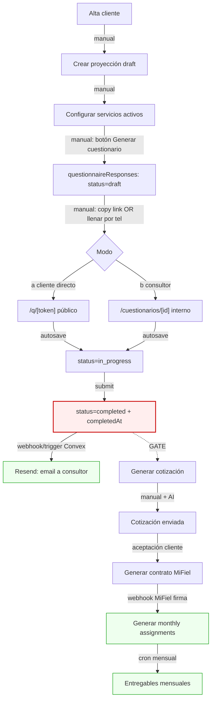

# 6. Cuestionario unificado — placement e integración

Esta sección define cómo el cuestionario UNIFICADO por proyección (decisión 2026-04-20) se engarza en el flujo comercial, qué schema soporta las preguntas, cómo se deduplican entre servicios, cómo se llena en los dos modos (cliente directo y consultor por teléfono), y cómo sus respuestas fluyen al resto de deliverables (cotización, contrato, entregables) vía el resolver de templates.

Premisas no revisadas (dadas por decisión previa):
- Un solo cuestionario por `projectionId`. No 5 por área.
- Dos modos de llenado: (a) `/q/[token]` público; (b) consultor interno.
- Schema de `questionnaireResponses` ya existe y no se toca en este sprint.

---

## 6.1 Placement en el flujo comercial

El cuestionario es el **primer gate bloqueante** después de crear la proyección. No se puede generar cotización sin que el cuestionario esté `completed` (gate fuerte). El resto de gates (contrato → monthly assignments → entregables) ya están modelados en secciones 3 y 5.



Leyenda de transiciones:
- **Manual**: A→B, B→C, C→D, D→E, K→L, L→M (botón en UI).
- **Automática (Convex trigger)**: I→J (email al consultor al completarse), N (al recibir webhook MiFiel firma), O (cron mensual — fuera de scope si deshabilitado).
- **Webhook externo**: M→N (MiFiel callback al firmar).
- **Gate bloqueante**: I (cuestionario `completed`) antes de K. Cotización no puede generarse con el cuestionario en otro estado.
- **Gate suave**: La UI puede permitir crear cotización SIN cuestionario en modo "borrador interno" sólo para super admin, pero nunca enviarla al cliente. En el sprint 15-may: mantenemos gate duro, sin excepciones.

Cuestionario es **opcional** sólo si la proyección se marca explícitamente como `skipQuestionnaire: true` (flag de escape hatch sólo para super admin). Fuera de scope del sprint — no se implementa hasta post-launch.

---

## 6.2 Modelo de datos de las preguntas (el gap)

**Problema actual:** `DEFAULT_QUESTIONS` está hardcodeado en `convex/functions/questionnaires/mutations.ts:7-20` con 3 preguntas genéricas. Necesitamos una fuente de verdad editable.

**Opciones:**

### Opción A — Reutilizar `deliverableTemplates` con `type="questionnaire"`
- Ya existe `type: "questionnaire"` en el schema (línea 287 de `convex/schema.ts`).
- Cada pregunta vive como `variables[].key` con `label=text`.
- Pros: cero tablas nuevas, ya modelado.
- Contras: `variables[]` no tiene `services[]`, `type` de input (textarea/file/select), `options`, `helpText`, `sortOrder`. Tendríamos que meter todo en un JSON blob ad-hoc o reinterpretar los campos existentes — frágil.
- Veredicto: **no recomendado**. Las preguntas tienen metadata específica (dedup por servicio, tipo de input, upload) que no encaja en el shape de "variable de template".

### Opción B — Nueva tabla `questionnaireQuestions` (RECOMENDADA)

```ts
questionnaireQuestions: defineTable({
  orgId: v.optional(v.string()),         // null = global (seed default Projex)
  key: v.string(),                       // e.g. "business_name"
  text: v.string(),                      // la pregunta mostrada
  services: v.array(v.string()),         // e.g. ["Legal", "Contable"]; [] = global
  type: v.union(
    v.literal("text"),
    v.literal("textarea"),
    v.literal("file_upload"),
    v.literal("select"),
    v.literal("radio"),
    v.literal("number"),
    v.literal("email"),
    v.literal("phone")
  ),
  options: v.optional(v.array(v.string())), // sólo para select/radio
  required: v.boolean(),
  helpText: v.optional(v.string()),
  sortOrder: v.number(),
  isActive: v.boolean(),                 // soft delete
  createdAt: v.number(),
})
  .index("by_orgId", ["orgId"])
  .index("by_orgId_active", ["orgId", "isActive"])
  .index("by_key", ["key"]),
```

**Justificación:**
- Separa el catálogo editable (preguntas) del registro de respuestas (`questionnaireResponses`, que ya existe y es immutable una vez `completed`).
- `orgId` opcional permite seed global (Projex) + override por org si una firma quiere personalizar.
- `services[]` permite dedup (ver 6.3) sin joins cruzados.
- Schema típico de "form builder minimalista", bien conocido.
- 1 tabla, 3 índices. Migración trivial (reemplaza hardcode).

**Decisión: Opción B**. El costo de la tabla extra (trivial) compensa la claridad de modelo vs. forzar el reuso de `deliverableTemplates`.

---

## 6.3 Lógica de dedup entre servicios

Al generar un cuestionario para una proyección con N servicios activos, evitamos mostrar la misma pregunta N veces. El mismo `key` aparece 1 vez y su `serviceNames[]` es la unión de todos los servicios que lo alimentan.

### Pseudocódigo

```
// convex/functions/questionnaires/generate.ts

function generateQuestionInstances(
  projectionId: Id<"projections">,
  activeServices: string[]   // e.g. ["Legal", "Contable", "TI"]
): QuestionInstance[] {

  // 1. Fetch active questions for this org (or global fallback)
  const allQuestions = ctx.db
    .query("questionnaireQuestions")
    .withIndex("by_orgId_active", q =>
      q.eq("orgId", currentOrgId).eq("isActive", true)
    )
    .collect();

  // 2. Filter: pregunta aplica si es global ([]) o si intersecta con activeServices
  const applicable = allQuestions.filter(q =>
    q.services.length === 0 ||
    q.services.some(s => activeServices.includes(s))
  );

  // 3. Map a QuestionInstance. Como ya filtramos por key único (la tabla
  //    garantiza una entrada por key), no hace falta deduplicar aquí.
  //    El serviceNames del response es la intersección real:
  return applicable
    .sort((a, b) => a.sortOrder - b.sortOrder)
    .map(q => ({
      questionId: q._id,
      questionKey: q.key,
      questionText: q.text,
      type: q.type,
      options: q.options,
      required: q.required,
      helpText: q.helpText,
      // servicios que esta respuesta alimentará:
      serviceNames: q.services.length === 0
        ? activeServices            // global → alimenta a todos los activos
        : q.services.filter(s => activeServices.includes(s)),
    }));
}
```

### Invariantes
- `QuestionInstance.questionKey` es único en el output.
- Si `q.services = []` (global), su `serviceNames` en el response = `activeServices` completo.
- Si `q.services = ["Legal"]` y la proyección sólo tiene `["Contable"]`, la pregunta NO aparece.
- Orden determinístico por `sortOrder`.

Ubicación: `convex/functions/questionnaires/generate.ts` (nueva, extraída del `generate` actual en `mutations.ts`).

---

## 6.4 UI modo (a) — cliente directo `/q/[token]`

Página pública Next.js App Router. No requiere sesión Clerk.

### Layout
- Header: logo de la org (`orgBranding.logoUrl`), color primario, nombre de la firma. Si la proyección tiene `issuingCompanyId` primaria (dependencia sección 4), se puede mostrar también.
- Subtítulo: "Cuestionario para [Cliente.name] — [Proyección.year]".
- Progress bar (`<Progress>` shadcn) con % completado.
- Si > 10 preguntas: render por secciones/pasos (agrupadas por `sortOrder` en buckets de 5-8). Botones "Anterior" / "Siguiente".
- Bloqueo: si `status === "completed"`, render en modo read-only con banner "Cuestionario ya enviado el [date]".

### Componentes shadcn/ui
- `<Form>` + react-hook-form + Zod schema derivado de `QuestionInstance[]`.
- `<Input>` para `text`, `email`, `phone`, `number`.
- `<Textarea>` para `textarea`.
- `<Select>` para `select`.
- `<RadioGroup>` para `radio`.
- Upload para `file_upload` → componente custom que llama `ctx.storage.generateUploadUrl()` y guarda `storageId` como `answer`.
- `<Progress>`, `<Button>`, `<Card>` para layout.

### Autosave
- `onChange` debounced 500ms → mutation `questionnaires.saveAnswer({ token, questionKey, answer })`.
- Primera mutación cambia `status: "draft" → "in_progress"`.
- Última mutación al presionar "Enviar": `status: "completed"`, `completedAt: Date.now()`.

### Envío
- Botón final "Enviar cuestionario" habilitado sólo si todas las `required` están llenas.
- Post-submit: redirige a `/q/[token]/gracias` con mensaje fijo (ya no renderea el form).
- Trigger de email al consultor (ver 6.8).

---

## 6.5 UI modo (b) — llenar por teléfono `/cuestionarios/[id]`

Vista interna, requiere sesión Clerk + membresía org. Ya surface-eada en commit `c1ad5ce`.

### Layout bicolumna optimizado para tomar notas en llamada
```
+-----------------------------------------------------+
| Llenado por Christian — modo teléfono     [3/12]    |
+-----------------------------------------------------+
| PREGUNTA ACTUAL                                     |
| "¿Cuál es el nombre legal del negocio?"             |
| (helpText gris claro si aplica)                     |
|                                                     |
| [ textarea / input grande, auto-focus ]             |
|                                                     |
| [Anterior (↑)]  [Guardar borrador]  [Siguiente (↓)] |
+-----------------------------------------------------+
| Sidebar derecho: lista de preguntas con estado      |
| - business_name       ✓                             |
| - contact_phone       ✓                             |
| - industry            → (actual)                    |
| - expected_revenue    —                             |
+-----------------------------------------------------+
| [Marcar como completado]  (disabled si falta req.)  |
+-----------------------------------------------------+
```

### Atajos de teclado
- `↓` / `Tab`: siguiente pregunta.
- `↑` / `Shift+Tab`: anterior.
- `Ctrl+Enter`: avanzar + guardar.
- `Ctrl+S`: guardar borrador explícito.

### Seguridad
- `accessToken` NO se expone en el URL. Query Convex valida `orgId` del caller vs. `questionnaireResponse.orgId`.
- Banner permanente "Llenado por [nombre] — modo teléfono" al top para dejar huella audit.
- `lastEditedBy: userId` opcional en `questionnaireResponses` (TBD, no crítico para MVP).

### UX específica para llamada
- Pregunta grande (texto 24px), respuesta grande (textarea min-height 120px).
- No paginación por secciones: una pregunta a la vez para no perder contexto auditivo.
- Auto-save en blur + cada 3s.
- Sidebar marca preguntas contestadas vs. pendientes.

Mismo backend que modo (a): mismas mutations `saveAnswer` y `markCompleted`, sólo diferente auth path.

---

## 6.6 Respuestas como variables en templates

Las respuestas del cuestionario deben poder consumirse en cotización, contrato y entregables, usando el resolver que ya existe (commits `dfec8cd` + `a80925d`).

### Sintaxis
```
{{questionnaire.<questionKey>}}
```

Ejemplo en HTML de cotización:
```html
<p>El cliente {{client.name}} (RFC {{questionnaire.tax_id_rfc}})
tiene como meta 12-meses: {{questionnaire.goals_12m}}.</p>
```

### Fallback si la pregunta no fue contestada
**Decisión: render como `—` (em-dash)** con log warning, NO error.

Razones:
- Error hard rompe el pipeline de generación PDF, indeseable.
- Placeholder tipo `[N/A]` se ve raro en un PDF formal.
- Em-dash `—` es neutro, legible, común en documentos consultoría.
- El log warning (`console.warn` en el resolver) permite detectar el gap en review humano antes de enviar.

Excepción: si la variable está marcada `required: true` en `deliverableTemplates.variables[]`, el render aborta y lanza error (el consultor debe decidir: llenar la pregunta o cambiar el template).

### Diff al schema `deliverableTemplates`

Agregar `"questionnaire"` a la unión de `source`:

```diff
  variables: v.array(
    v.object({
      key: v.string(),
      label: v.string(),
      source: v.union(
        v.literal("client"),
        v.literal("projection"),
        v.literal("service"),
        v.literal("ai"),
-       v.literal("manual")
+       v.literal("manual"),
+       v.literal("questionnaire")
      ),
      required: v.boolean(),
    })
  ),
```

### Integración con resolver existente
En el pipeline de resolución (ver commit `a80925d`), agregar caso:

```
case "questionnaire":
  const response = await ctx.db
    .query("questionnaireResponses")
    .withIndex("by_projectionId", q => q.eq("projectionId", projectionId))
    .first();
  if (!response) return "—";
  const match = response.responses.find(r => r.questionId === variable.key);
  return match?.answer ?? "—";
```

Nota: `questionId` en `responses[]` debe ser el `key` (string legible), no el `_id` de `questionnaireQuestions`, para que el template referencie `{{questionnaire.business_name}}` en vez de un ID opaco. Ajustar en 6.3 si aún no está así.

---

## 6.7 AI prefill / sugerencias

**Recomendación: NO para el sprint 15-may.** Backlog post-launch.

### Justificación
- **ROI bajo**: el cuestionario se llena 1 vez por cliente. Ahorrar 5 min de escritura vs. consultor revisando AI output es break-even.
- **Riesgo alto**: las respuestas acaban literal en contrato y cotización. Un AI hallucination en `tax_id_rfc` o `annual_revenue` es un bug de dinero/legal.
- **Deadline tight**: 22-abr a 15-may son 23 días. El track crítico es dedup + placement + template resolution, no nice-to-haves.
- Precedente en el producto: ya hay AI en cotización (commit `dfec8cd`) DONDE el output es prosa, no datos estructurados. AI en el cuestionario mezcla los dos riesgos.

### Backlog post-launch (anotar en `docs/backlog.md`)
- Endpoint: `POST /api/questionnaires/suggest` con `{ questionKey, clientContext: { rfc, industry, name } }`.
- Prompt: "Eres un asistente para una firma de consultoría mexicana. Dado el cliente [nombre], RFC [rfc], industria [industria], sugiere un valor razonable para la pregunta: [texto]. Si no tienes información suficiente, responde NULL."
- Render: la sugerencia aparece como placeholder del input, con label "Sugerido por IA — revisa antes de aceptar". El consultor debe confirmar explícitamente.
- Out-of-scope para campos financieros y legales (`tax_id_rfc`, `annual_revenue`, `constitutive_act_upload`).

---

## 6.8 Notificaciones y email flow

### Al completarse (`status → completed`)
1. Trigger desde la mutation `markCompleted` (Convex `action` con `"use node"` para Resend).
2. Buscar consultor dueño: `clients.assignedTo` o fallback al primer admin de la org.
3. Resend email:
   - Subject: "Cuestionario completado — [Cliente.name]"
   - Body HTML con: link a `/cuestionarios/[id]` (ver respuestas) + botón "Generar cotización" linkeando a `/proyecciones/[projectionId]/cotizacion/nueva`.
   - From: `no-reply@[org-domain]` (usa primary issuing company si aplica, fallback a `no-reply@projex.com`).
4. Escribir entrada en `emailLog`:
   - `type: "questionnaire_completed"`, `projectionId`, `toEmail`, `resendId`, `status`, `sentAt`.

### Recordatorios al cliente si lleva >48h en `in_progress`
**Backlog, no MVP.** Requiere cron Convex habilitado. Flag explícito en `docs/backlog.md`.

Si el cron está habilitado antes de 15-may: cron diario busca `status=in_progress AND createdAt < now() - 48h AND reminderCount < 2`, envía email vía Resend al mismo `accessToken` link. Incrementa `reminderCount` en `questionnaireResponses` (campo opcional a agregar).

---

## 6.9 Archivado de cuestionarios obsoletos

Los 5 HTML actuales son basura histórica:
- `docs/templates/html/admin-questionnaire.*`
- `docs/templates/html/legal-questionnaire.*`
- `docs/templates/html/ti-questionnaire.*`
- `docs/templates/html/marketing-questionnaire.*`
- `docs/templates/html/financiero-questionnaire.*`

### Plan
1. **NO borrar hasta tener el seed unificado funcionando end-to-end** (dummy + real de papá si llega).
2. Cuando el seed esté vivo (probablemente 2026-04-28 en track Christian):
   - Crear `docs/templates/html/_archived/` (gitkeep si no existe).
   - Mover los 5 archivos ahí con `git mv`.
   - Agregar `docs/templates/html/_archived/README.md` con nota "Archivados 2026-04-XX por decisión 2026-04-20 — cuestionario unificado. Ver sección 6 del spec Projex v2."
3. Update `docs/pendientes-cuestionario.md`:
   - Marcar el archivado como done.
   - Registrar fecha real de seed unificado.

No borrar del git history. `_archived/` queda como referencia histórica.

---

## 6.10 Plan de desbloqueo si papá tarda

Al 2026-04-22, papá lleva 1 día de retraso en entregar el contenido unificado. Si al 2026-04-23 sigue sin entregar: **ejecutar plan B en la mañana, escalar a papá + stakeholder en paralelo**.

### Plan B — Seed mínimo escrito por Christian (1h)

12 preguntas unificadas, específicas para consultoría mexicana, suficientes para validar el flujo end-to-end:

| key | text (abreviado) | type | services | required |
|-----|------------------|------|----------|----------|
| `business_name` | Nombre legal del negocio | text | [] global | true |
| `tax_id_rfc` | RFC del cliente | text | [] global | true |
| `contact_phone` | Teléfono de contacto | phone | [] global | true |
| `contact_email` | Email de contacto | email | [] global | true |
| `industry` | Industria principal | select | [] global | true |
| `expected_monthly_revenue` | Ingreso mensual esperado (MXN) | number | [Contable, Comisiones] | true |
| `key_pain_points` | Problemas principales a resolver | textarea | [] global | true |
| `constitutive_act_upload` | Acta constitutiva (PDF) | file_upload | [Legal, Contable] | false |
| `prior_accountant` | Contador/despacho anterior | textarea | [Contable] | false |
| `goals_12m` | Objetivos a 12 meses | textarea | [] global | true |
| `competitors` | Competidores directos | textarea | [Marketing] | false |
| `custom_branding_needs` | Necesidades de branding/marca | textarea | [Marketing] | false |

### Swap cuando llegue contenido de papá
- El seed dummy se carga vía `seed.ts` script idempotente (upsert por `key`).
- Cuando papá entregue: Christian edita las preguntas en UI admin (futuro) o directamente el seed script, corre `npx convex run seed:questionnaireQuestions`.
- Respuestas ya existentes no se ven afectadas (responses guardan `questionText` snapshot).

### Escalamiento
Si papá no entrega al 2026-04-24: escalar a stakeholder + congelar contenido en el seed dummy. El MVP 15-may sale con el seed. Documentar en `docs/pendientes-cuestionario.md` como "contenido v1 definitivo por stakeholder decision".

---

## 6.11 Data dummy para validar el track

Christian siembra antes de 2026-04-29:
1. **1 cliente**: `Taqueria Don Pepe SA de CV`, RFC `TDP850101ABC`, industria `Food & Beverage`.
2. **1 proyección** para ese cliente, año 2026, con **5 servicios activos**: Legal, Contable, TI, Marketing, RH.
3. **1 cuestionario generado** via `generate({ projectionId })`:
   - Input: 12 preguntas seed dummy + 5 servicios.
   - Expected output: 12 preguntas únicas (no 60). Dedup aplicada. `business_name` aparece 1 vez con `serviceNames = [Legal, Contable, TI, Marketing, RH]`. `prior_accountant` aparece 1 vez con `serviceNames = [Contable]`.
4. **Llenado manual en modo (a)**: 6 de 12 preguntas vía `/q/[token]` público. Verify autosave, progress bar, validación required.
5. **Llenado manual en modo (b)**: las 6 restantes vía `/cuestionarios/[id]` interno. Verify atajos de teclado, banner "Llenado por Christian".
6. **Cotización generada** usando 3 respuestas como variables:
   - Template de cotización contiene `{{questionnaire.business_name}}`, `{{questionnaire.goals_12m}}`, `{{questionnaire.expected_monthly_revenue}}`.
   - Render PDF debe mostrar los 3 valores correctamente.
   - Una cuarta variable `{{questionnaire.nonexistent_key}}` debe renderear como `—` sin romper el PDF.

Snapshot de este flujo se graba como demo para 2026-05-15.

---

## 6.12 Testing

Casos de test (no código, prioridades del sprint):

### Funcionales
1. **Dedup correcta**: 12 preguntas seed + 5 servicios → 12 question instances, no 60. Pregunta global → `serviceNames = todos`. Pregunta con `services=[Legal]` en proyección con `[Legal, Contable]` → `serviceNames=[Legal]`.
2. **Modo (a) orgId isolation**: token público de org A no puede leer/escribir `questionnaireResponses` de org B. Probar con 2 orgs seeded.
3. **Modo (b) auth**: usuario sin sesión Clerk → redirige a login. Usuario de org B → 403 o "no encontrado".
4. **Autosave sin race conditions**: typing rápido en 3 preguntas distintas + submit antes de que el debounce resuelva → todas las respuestas persisten.
5. **Upload file > 10MB**: Convex storage rechaza, UI muestra error claro "Archivo máximo 10MB". No rompe el form.
6. **Gate de cotización**: botón "Generar cotización" disabled si `questionnaireResponses.status !== "completed"`.
7. **Render template**: `{{questionnaire.business_name}}` resuelve a valor real. `{{questionnaire.not_answered}}` resuelve a `—`. `{{questionnaire.required_missing}}` en una variable `required:true` → error controlado, PDF no se genera, mensaje al consultor.

### Edge cases
8. Proyección sin servicios activos → `generate` falla con mensaje claro.
9. Cuestionario ya existe para `projectionId` → `generate` rechaza (ya implementado en mutations.ts:42).
10. Cliente completa cuestionario 2 veces (refresh + submit) → `markCompleted` idempotente.
11. Consultor completa cuestionario en modo (b) después de que cliente lo envió en modo (a) → bloqueado por `status=completed`.

### No funcionales
12. Carga inicial de `/q/[token]` < 2s en 4G.
13. Autosave mutation < 500ms p95.
14. PDF con 3 variables `questionnaire.*` se genera en < 3s.

---

## 6.13 Out-of-scope para 15-may

Declarado explícito — NO se implementa en este sprint:

- **Lógica condicional** (si respuesta X = Y → mostrar pregunta Z). Añade complejidad de form engine. Backlog.
- **Multi-idioma** (i18n de preguntas). Todo en español mexicano. Backlog.
- **Firma digital del cuestionario**. El cuestionario no es un contrato legal. Firma sólo aplica en 6.1 paso M (MiFiel).
- **Versionado de preguntas**. Seed único; si cambian las preguntas, cuestionarios viejos mantienen snapshot en `responses[].questionText`. No se versiona la tabla `questionnaireQuestions`.
- **Dashboard analytics** (cuántos cuestionarios completed este mes, tiempo promedio, etc.). Backlog.
- **Recordatorios automáticos al cliente** si cron está deshabilitado (mencionado en 6.8).
- **AI prefill** (ver 6.7, backlog).
- **Admin UI para editar preguntas**. MVP: edición directa en seed script. UI admin es backlog.
- **Export de cuestionario a PDF para firma impresa**. Sólo se renderea web.

---

## Dependencias con otras secciones

- **Sección 1 (schema multi-tenant)**: `questionnaireResponses` ya tiene `orgId`. `questionnaireQuestions` también lo tendrá.
- **Sección 2 (CRUD empresas facturadoras)**: header branding de `/q/[token]` usa `issuingCompany` primaria si existe — sólo cosmético, no gate.
- **Sección 3 (pipeline cotización→contrato)**: gate bloqueante en 6.1 (cuestionario `completed` antes de cotización).
- **Sección 4 (templates por empresa)**: diff a `deliverableTemplates.variables[].source` en 6.6. Requiere coordinación de migración.
- **Sección 5 (proyección SAT+Excel)**: `activeServices[]` se lee de `projectionServices` (tabla existente).

---

## Riesgos abiertos al cierre de esta sección

1. **Bloqueante primario**: contenido de papá retrasado. Mitigado por plan B en 6.10.
2. **Bloqueante secundario detectado**: el diff a `deliverableTemplates.variables[].source` (6.6) requiere que el resolver ya existente (`a80925d`) sepa manejar `"questionnaire"`. Si el resolver está tipado estrictamente, agregar el case es 1 PR chico — verificar antes del 2026-04-28.
3. **Riesgo de UX modo (b)**: si consultor es interrumpido en la llamada y el autosave falla silenciosamente, pierde respuestas. Mitigación: indicador visible "Guardado hace Ns" en UI.
4. **Riesgo de dedup**: si una pregunta se marca `services=[Legal]` pero el consultor la necesita alimentando también Contable, el modelo no lo permite post-hoc. Mitigación MVP: preguntas ambiguas se marcan como globales (`services=[]`).

---

_Fin de Sección 6._
