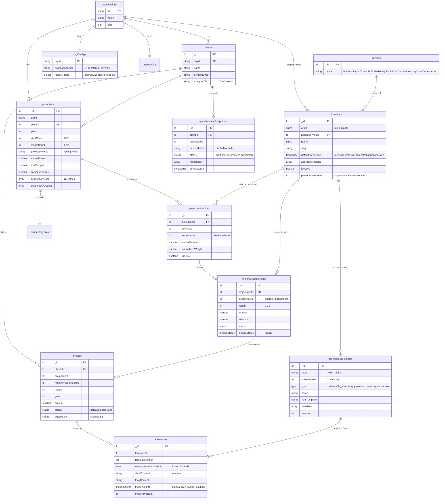
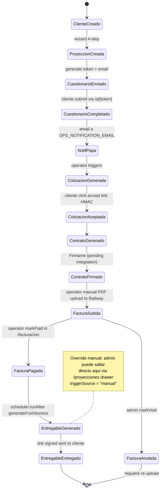
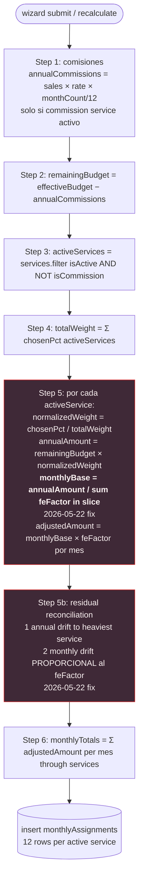
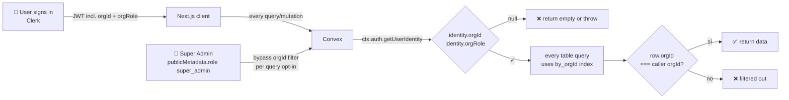

# Projex — System architecture (2026-05-22 snapshot)

Diagramas Mermaid del sistema en su estado actual post-sprint v2. Renderiza directo en GitHub/VS Code (markdown preview).

---

## 1. Arquitectura de alto nivel

```mermaid
graph TB
    subgraph Browser["🌐 Browser - Operador"]
        UI_Wizard["/proyecciones/nueva<br/>Wizard 4 steps"]
        UI_Matrix["/proyecciones/[id]<br/>Matriz mensual + drawer"]
        UI_Fact["/facturacion<br/>Upload PDF + markPaid"]
        UI_Tmpl["/configuracion/plantillas<br/>Tree Servicio→Subservicio"]
        UI_Quest["/cuestionarios<br/>Lista + share link"]
        UI_Entreg["/entregables/[id]<br/>Preview iframe + PDF"]
        UI_Conf["/configuracion/*<br/>Branding, notif, integraciones"]
        UI_Plat["/platform/*<br/>Super-admin: orgs, métricas, templates"]
    end

    subgraph PublicWeb["🔗 Browser - Cliente final - sin auth"]
        UI_Pub["/q/[token]<br/>Responder cuestionario"]
    end

    subgraph NextJS["▲ Next.js 15 - Vercel"]
        Pages["App Router pages<br/>(client + server)"]
        APIPdf["/api/generate-pdf<br/>puppeteer-core route"]
        APIClerk["/api/clerk/*<br/>webhooks, invite"]
    end

    subgraph Convex["⚡ Convex - DB + Server functions"]
        Queries["queries.ts<br/>read auth+org-filtered"]
        Mutations["mutations.ts<br/>write auth+org-filtered"]
        Actions["actions.ts<br/>side effects external"]
        Internal["internal.* / publicMutations<br/>scheduler + token paths"]
        Scheduler["ctx.scheduler.runAfter<br/>job queue async"]
        Crons["crons.ts<br/>daily overdue + eligibility scan"]
    end

    subgraph External["🔌 External services"]
        Clerk["🔐 Clerk<br/>Auth + Organizations<br/>org:admin / org:member"]
        Resend["📧 Resend<br/>Email send only<br/>FROM noreply@biz...com"]
        Claude["🤖 Claude API<br/>AI variable fill<br/>claude-sonnet-4-20250514"]
        Railway["📦 Railway S3<br/>PDF/factura blob storage<br/>metadata in Convex"]
        Firmame["✍️ Firmame<br/>Firma digital - pending integration"]
    end

    UI_Wizard --> Pages
    UI_Matrix --> Pages
    UI_Fact --> Pages
    UI_Tmpl --> Pages
    UI_Quest --> Pages
    UI_Entreg --> Pages
    UI_Conf --> Pages
    UI_Plat --> Pages
    UI_Pub --> Pages

    Pages -->|useQuery / useMutation / useAction| Queries
    Pages --> Mutations
    Pages --> Actions
    Pages -->|signed-in identity| Clerk

    APIPdf -->|HTML to PDF| Browser
    Actions -->|fetch HTML to PDF| APIPdf

    Mutations -->|enqueue| Scheduler
    Scheduler --> Actions
    Crons --> Internal
    Internal --> Mutations

    Actions -->|sendEmail| Resend
    Actions -->|messages.create| Claude
    Actions -->|S3 PUT blob| Railway
    Mutations -->|metadata only| Railway

    Queries -.->|JWT orgRole| Clerk
    Mutations -.->|JWT orgRole| Clerk
    UI_Pub -.->|accessToken, no auth| Internal

    classDef external fill:#1e293b,stroke:#475569,color:#cbd5e1
    classDef ui fill:#1e3a8a,stroke:#3b82f6,color:#dbeafe
    classDef backend fill:#14532d,stroke:#22c55e,color:#dcfce7
    class Clerk,Resend,Claude,Railway,Firmame external
    class UI_Wizard,UI_Matrix,UI_Fact,UI_Tmpl,UI_Quest,UI_Entreg,UI_Conf,UI_Plat,UI_Pub ui
    class Queries,Mutations,Actions,Internal,Scheduler,Crons backend
```

---

## 2. Data model — tablas principales

---

## 3. Lifecycle de documento (estado)

---

## 4. Generación de entregable — flujo paralelo (auto vs override)

```mermaid
sequenceDiagram
    participant Op as Operador<br/>(browser)
    participant Mut as invoices.markPaid<br/>(mutation)
    participant Sch as ctx.scheduler
    participant GFI as generateFromInvoice<br/>(internalAction)
    participant Sel as selectDeliverableForMonth<br/>(internalQuery)
    participant Gen as generateDeliverable<br/>(action)
    participant Ai as Claude API
    participant Pdf as /api/generate-pdf
    participant Rail as Railway S3
    participant Db as Convex DB

    rect rgb(20, 50, 80)
    Note over Op,Db: 🔵 PATH AUTO — markPaid dispara
    Op->>Mut: click "Marcar pagada" en /facturacion
    Mut->>Db: patch invoice.status = "paid"
    Mut->>Sch: runAfter(0, generateFromInvoice, invoiceId)
    Mut-->>Op: { ok: true }
    Sch->>GFI: (async)
    GFI->>Db: load invoice
    GFI->>GFI: idempotency check by triggerInvoiceId
    GFI->>Sel: select template by frequency + subserviceId
    Sel-->>GFI: template snapshot
    GFI->>Gen: generateDeliverable(templateOverride)
    end

    rect rgb(80, 50, 20)
    Note over Op,Db: 🟠 PATH OVERRIDE MANUAL — admin click
    Op->>Gen: click "Generar entregable ahora"<br/>(drawer matrix-cell)
    Note over Gen: triggerSource = "manual"<br/>templateType = "deliverable_long"
    end

    Gen->>Db: load assignment, client, projService
    Note over Gen: 🛑 GUARD 2026-05-22:<br/>throw if assignment.subserviceId is null
    Gen->>Db: load questionnaire + orgBranding + template
    Gen->>Ai: batchFillWithClaude<br/>(retry 3x, cost tracking)
    Ai-->>Gen: filled variables
    Gen->>Db: insert deliverable<br/>(short + long content + snapshot)
    Gen->>Pdf: POST html → PDF buffer
    Pdf->>Pdf: puppeteer-core launch local Chrome<br/>(CHROMIUM_PATH env)
    Pdf-->>Gen: PDF blob
    Gen->>Rail: PUT pdf blob
    Gen->>Db: patch deliverable.pdfBucketKey
    Gen-->>Op: deliverable._id
    Op->>Op: navigate to /entregables/[id]<br/>iframe srcDoc preview
```

---

## 5. Engine: cálculo de allocation mensual (post-fix Katimi)

---

## 6. Multi-tenant isolation

---

## Cómo se actualiza este doc

Cuando cambies arquitectura significativa:

1. Edita la sección correspondiente.
2. Si agregas un componente nuevo, agrégalo al diagrama de §1.
3. Si agregas tabla nueva, extiende §2.
4. Si cambias un flow de generación, actualiza §4.
5. Commit con mensaje `docs(architecture): <qué cambió>`.

Para diagramas más detallados temporales (durante brainstorming) — usa Excalidraw, no permanente.
